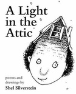

# Web Scraping com Python

Projeto simples e didático de Web Scraping em Python, dividido em dois exemplos práticos:

- 📜 Scraping de frases do site [quotes.toscrape.com](https://quotes.toscrape.com/)
- 📚 Download e visualização de capas de livros do [books.toscrape.com](http://books.toscrape.com/)

---

## 🚀 Como rodar

1. Clone o repositório:
```bash
git clone https://github.com/camfeitosa/web-scraping-python.git
cd web-scraping-python
```

2. Crie e ative o ambiente virtual:
```bash
python -m venv venv
venv\Scripts\activate   # Windows
# ou
source venv/bin/activate  # Linux/macOS
```

3. Instale as dependências:
```bash
pip install -r requirements.txt
```

4. Rode os scripts:

- Frases:
```bash
python quotes/main.py
```

- Capas de livros:
```bash
python book/main.py
```

---

## 🛠️ Tecnologias

- Python 3.x
- BeautifulSoup4
- Requests
- Matplotlib
- Pillow
- shutil

---

## Exemplo visual - Capa de livro


